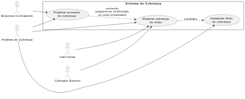
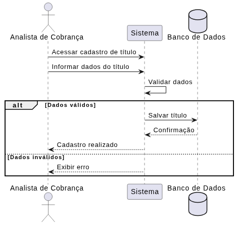
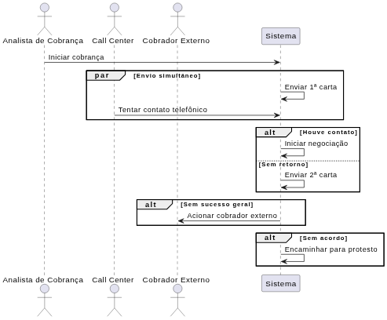
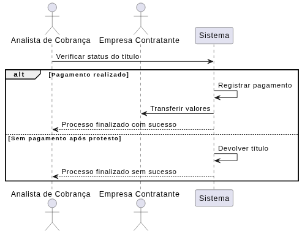

# Atividade 02/04/2026 — Engenharia de Software
**Sistema Integrado de Gestão de Farmácia — MVP Definido pelo Estudante**

Aluno: *João Vitor Toledo da Silva*  
RA: *24000550*  
Data: *02/04/2026*  

---

# 1. Definição do MVP

> “Meu MVP cobre o processo de cobrança desde o cadastro do título até a finalização por pagamento ou protesto, incluindo envio de cartas, contato telefônico e registro de negociações.”

### Dentro do MVP
- Cadastro de títulos de cobrança  
- Envio automático da 1ª e 2ª carta  
- Registro de tentativas de contato telefônico  
- Início e registro de negociações  
- Registro de pagamento  
- Protesto do título  
- Finalização do processo  

### Fora do MVP
- Integração real com serviços externos (SMS, e-mail, APIs bancárias)  
- Interface avançada (dashboard completo)  
- Automação de cobrador externo (apenas simulado)  
- Relatórios avançados  

### Justificativa
O MVP foi definido focando nas funcionalidades essenciais do processo de cobrança, garantindo que todo o fluxo principal funcione do início ao fim. Funcionalidades mais complexas ou integrações externas foram deixadas de fora para reduzir a complexidade inicial e permitir validação rápida da solução.

---

# 2. Regras de Negócio

**RN01 — Cadastro obrigatório do título**  
Todo título recebido deve ser cadastrado no sistema antes de iniciar qualquer ação de cobrança.

**RN02 — Execução simultânea**  
O envio da 1ª carta de cobrança e a tentativa de contato telefônico devem ocorrer de forma simultânea.

**RN03 — Envio da 2ª carta**  
A 2ª carta de cobrança só deve ser enviada caso não haja retorno da 1ª carta.

**RN04 — Início da negociação**  
A negociação só pode ser iniciada caso haja contato com o devedor e interesse no pagamento.

**RN05 — Protesto do título**  
O título deve ser protestado caso não haja acordo ou pagamento após as tentativas de cobrança.

---

# 3. Requisitos Funcionais

**RF01 —** Cadastrar título de cobrança no sistema  
**RF02 —** Enviar automaticamente a 1ª e 2ª carta de cobrança  
**RF03 —** Registrar tentativas de contato telefônico  
**RF04 —** Permitir iniciar e registrar negociações  
**RF05 —** Registrar pagamento e finalizar o processo  

---

# 4. Requisitos Não Funcionais

**RNF01 —** O sistema deve ser acessível via web (navegador)  

**RNF02 —** O sistema deve garantir a segurança dos dados dos usuários e devedores  

**RNF03 —** O sistema deve possuir interface simples e de fácil utilização  

--- 

## 5. Casos de Uso

### Caso de Uso 1 — Cadastrar título de cobrança
- **Ator principal:** Analista de Cobrança  
- **Descrição:** Responsável por inserir um novo título no sistema, permitindo que o processo de cobrança seja iniciado.  
- **Pré-condição:** O título deve ter sido recebido pela empresa.  
- **Pós-condição:** O título fica disponível no sistema para iniciar a cobrança.  

---

### Caso de Uso 2 — Realizar cobrança do título
- **Atores envolvidos:**
  - Analista de Cobrança
  - Call Center
  - Cobrador Externo

- **Descrição:** Executa todo o processo de cobrança, incluindo envio de cartas, tentativas de contato e negociação com o devedor.  

- **Fluxo principal:**
  - Envio da 1ª carta de cobrança  
  - Tentativa de contato telefônico (simultâneo à 1ª carta)  
  - Caso não haja retorno, envio da 2ª carta  
  - Caso haja contato, iniciar negociação  
  - Se não houver sucesso, acionar cobrador externo  
  - Se ainda não houver acordo, encaminhar para protesto  

- **Relacionamento:**
  - **include** Cadastrar título de cobrança  

- **Pré-condição:** O título deve estar cadastrado no sistema.  
- **Pós-condição:** O título segue para pagamento ou protesto.  

---

### Caso de Uso 3 — Finalizar processo de cobrança
- **Atores envolvidos:**
  - Analista de Cobrança
  - Empresa Contratante

- **Descrição:** Responsável por encerrar o processo de cobrança após pagamento ou conclusão sem sucesso.  

- **Fluxo principal:**
  - Confirmar pagamento do título  
  - Transferir valores para a empresa contratante  
  - Encerrar processo  

- **Fluxos alternativos:**
  - Caso não haja pagamento após protesto, o título é devolvido  
  - Processo é finalizado sem sucesso  

- **Relacionamento:**
  - **extend** Realizar cobrança do título (quando há pagamento ou protesto)  

- **Pré-condição:** O processo de cobrança deve ter sido executado.  
- **Pós-condição:** Processo encerrado (com ou sem sucesso).  

---

# 6. Documentação dos Casos de Uso

---

## **UC01 — Cadastrar título de cobrança**
**Ator(es):** Analista de Cobrança  
**Descrição:** Realiza o cadastro de um título no sistema para que o processo de cobrança possa ser iniciado.  
**Pré-condições:** O título deve ter sido recebido pela empresa.  
**Pós-condições:** O título fica registrado no sistema e disponível para cobrança.  

### Fluxo Principal
1. O analista acessa a funcionalidade de cadastro de título  
2. O analista informa os dados do título (devedor, valor, vencimento, etc.)  
3. O sistema valida as informações  
4. O sistema registra o título com sucesso  

### Fluxos Alternativos / Exceções
- FA01 — Dados inválidos: o sistema informa erro e solicita correção  
- FA02 — Título já cadastrado: o sistema impede duplicidade  

---

## **UC02 — Realizar cobrança do título**
**Ator(es):** Analista de Cobrança, Call Center, Cobrador Externo  
**Descrição:** Executa o processo de cobrança do título, incluindo envio de cartas, tentativas de contato e negociação.  
**Pré-condições:** O título deve estar cadastrado no sistema.  
**Pós-condições:** O título segue para pagamento ou protesto.  

### Fluxo Principal
1. O sistema envia a 1ª carta de cobrança  
2. O Call Center realiza tentativa de contato telefônico simultaneamente  
3. Caso haja contato, inicia-se a negociação  
4. Caso não haja retorno, o sistema envia a 2ª carta  
5. Se não houver sucesso, o cobrador externo é acionado  
6. Caso não haja acordo, o título é encaminhado para protesto  

### Fluxos Alternativos / Exceções
- FA01 — Contato realizado com sucesso: inicia negociação  
- FA02 — Sem retorno das cartas e telefone: acionamento do cobrador externo  
- FA03 — Sem acordo após tentativas: título segue para protesto  

---

## **UC03 — Finalizar processo de cobrança**
**Ator(es):** Analista de Cobrança, Empresa Contratante  
**Descrição:** Finaliza o processo de cobrança após pagamento ou encerramento sem sucesso.  
**Pré-condições:** O processo de cobrança deve ter sido executado.  
**Pós-condições:** Processo encerrado com ou sem sucesso.  

### Fluxo Principal
1. O sistema identifica o pagamento do título  
2. O sistema registra a quitação  
3. O valor é transferido para a empresa contratante  
4. O sistema finaliza o processo  

### Fluxos Alternativos / Exceções
- FA01 — Pagamento após protesto: processo é finalizado normalmente  
- FA02 — Não pagamento após protesto: título é devolvido e processo encerrado  

